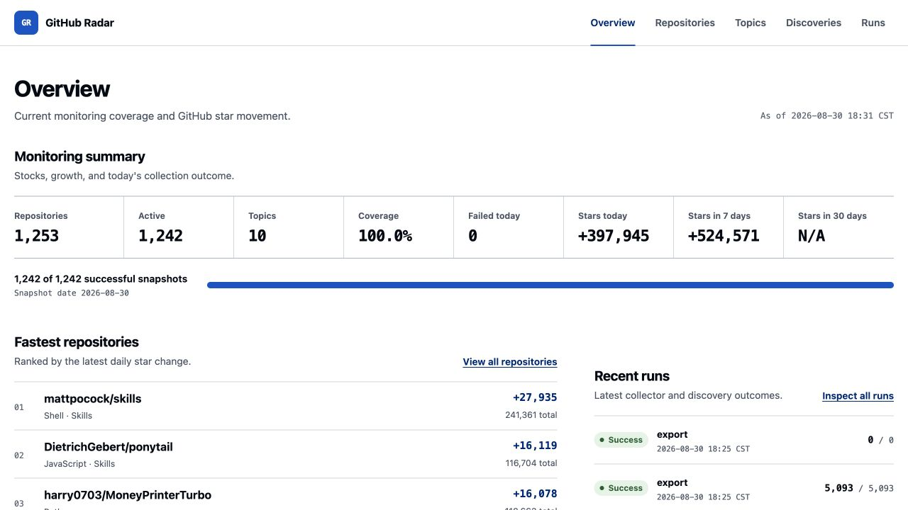
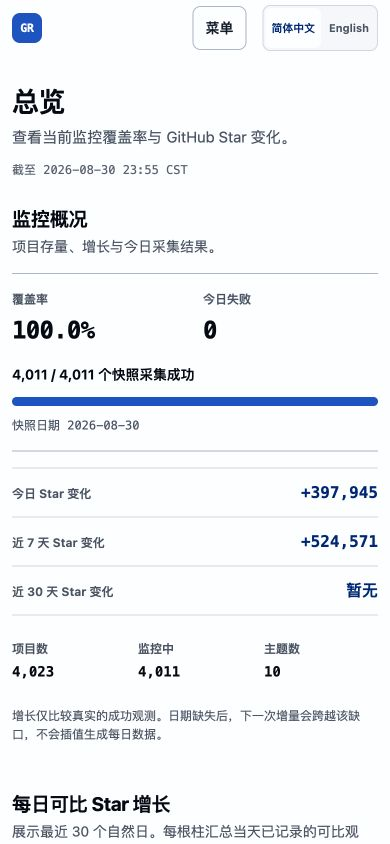
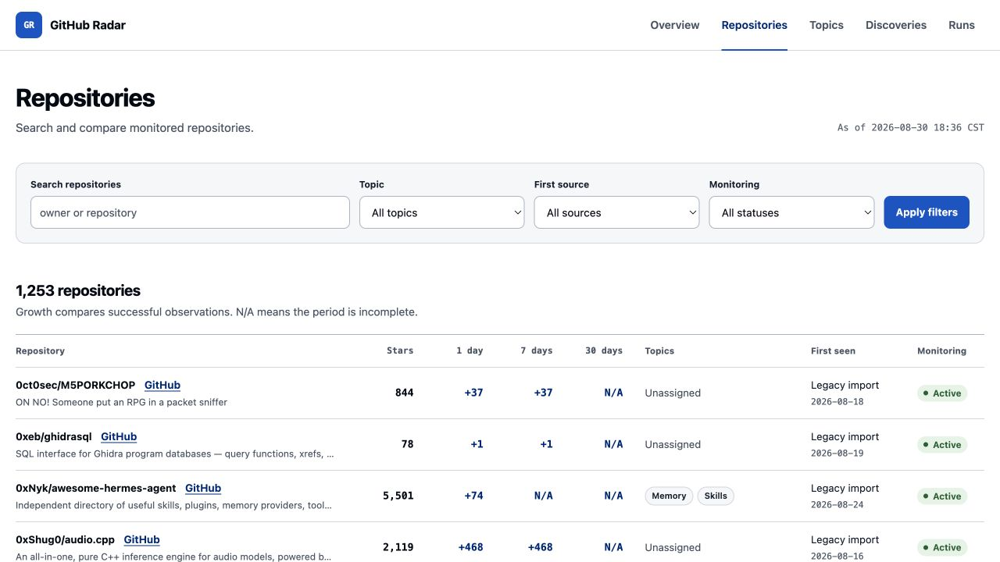
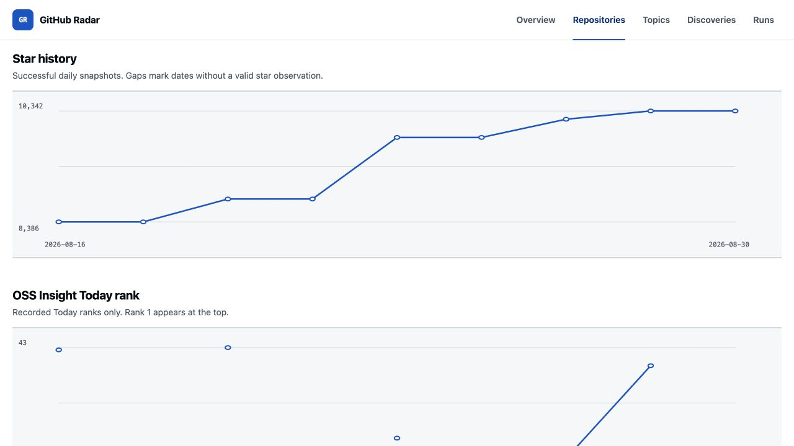
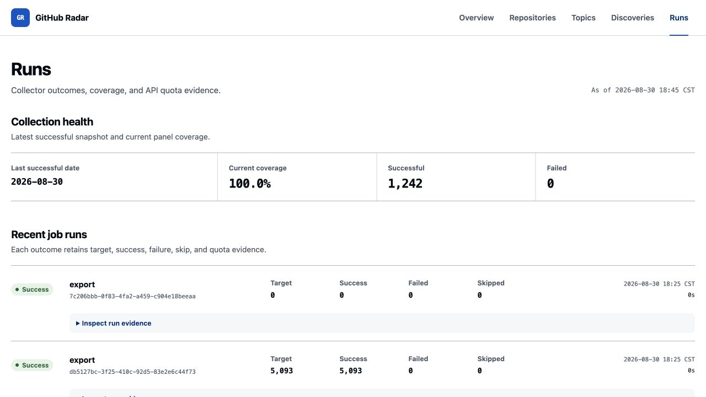

# GitHub Radar

GitHub Radar is a self-hosted monitor for GitHub repository and topic star
history. It builds a fixed daily panel from several discovery signals, keeps
failures explicit, and provides auditable exports and a read-only Web dashboard.

The goal is long-term technical trend research. GitHub Radar does not provide
investment scores, trading advice, or claims of causal relationships.

## Why another GitHub monitor?

Daily trending lists answer which repositories are moving now. They do not
preserve a stable population, and their growth figures are not the same as an
absolute GitHub star count. GitHub Radar separates two jobs:

- **Discovery** finds candidates through OSS Insight, GitHub Search, legacy
  observations, and a manual watchlist.
- **Snapshotting** asks GitHub for the absolute star count of every active
  repository once per Shanghai calendar day.

OSS Insight is a momentum signal. Its `stars` value is the number of stars
inside a rolling window. GitHub Search complements it with mature high-star
projects, topic leaders, recent movers, and benchmark repositories. Neither
source is treated as a complete enumeration of GitHub.

The default single-host configuration keeps the active population below the
authenticated GitHub Core API budget (normally 5,000 requests/hour). Broad
monthly coverage is present but disabled until the operator checks Search
`total_count` and snapshot capacity.

## Features

- Immutable GitHub repository ID deduplication across renames and transfers.
- Today, Week, Month, and 3 Months OSS Insight discovery.
- Configurable GitHub Repository Search profiles with paging, query partitioning,
  incomplete-result detection, and separate Search rate handling.
- One explicit success or failure row per active repository per day.
- Two-level topic taxonomy with manual assignments taking precedence.
- Legacy SQLite, CSV, YAML, JSON, and manual-watchlist input paths.
- CSV, JSON, and SQLite exports.
- Embedded Chinese/English server-rendered dashboard with no frontend build chain.
- One static Go binary, SQLite WAL, Cron collection, and systemd Web service.

## Architecture

```text
OSS Insight -------+
GitHub Search -----+--> registry by GitHub ID --> daily GitHub snapshots
legacy data -------+               |                       |
manual watchlist --+               +--> topics             +--> SQLite
                                                               |
                                                    CSV / JSON / Web
```

See [architecture](docs/architecture.md), [data model](docs/data-model.md), and
[discovery semantics](docs/discovery.md) for the design details.

## Requirements

- Go 1.27 or newer to build from source.
- A GitHub token for useful API capacity. Fine-grained read-only repository
  metadata access is sufficient for public repositories.
- Linux for the included Cron and systemd deployment files.

The production binary is built with `CGO_ENABLED=0`; SQLite does not require a
system C toolchain.

## Build

```sh
git clone https://github.com/xz1220/github-radar.git
cd github-radar
make ci
make build
```

Cross-compile the deployment artifact with:

```sh
make build-linux
```

## Configure

Copy the examples and keep the real environment file outside the repository:

```sh
cp config/discovery.example.yaml discovery.yaml
cp config/topics.example.yaml topics.yaml
cp deploy/tencent2/github-radar.env.example .env.example.local
```

At minimum, set:

```sh
read -r -s GITHUB_RADAR_GITHUB_TOKEN
export GITHUB_RADAR_GITHUB_TOKEN
export GITHUB_RADAR_DB_PATH="$PWD/github-radar.db"
export GITHUB_RADAR_DISCOVERY_CONFIG="$PWD/discovery.yaml"
export GITHUB_RADAR_TOPICS_CONFIG="$PWD/topics.yaml"
export GITHUB_RADAR_LOCALE=zh-CN
```

Do not place a real token in a tracked file, a Cron line, a systemd unit, a
command argument, or a screenshot.

## First run

Check configuration and initialize the database:

```sh
./bin/github-radar doctor
./bin/github-radar topic list
```

Discover a small configured profile, then collect a snapshot:

```sh
./bin/github-radar discover --source github-search --profile benchmark-projects
./bin/github-radar snapshot
```

Run the complete idempotent daily sequence with:

```sh
./bin/github-radar run-daily
```

A discovery error is recorded but does not cancel snapshots for repositories
already in the registry.

## Import existing history

Import the existing OSS Insight digest SQLite database without changing it:

```sh
./bin/github-radar import-legacy \
  --path /path/to/ossinsight-feishu-digest/state.db
```

The importer reads every repository in the legacy `repos` table, not only the
published catalog. It preserves real `daily_observations` and leaves missing
days empty. Rolling OSS Insight trend rows are never rewritten as absolute
GitHub star history.

Other candidates can be added with:

```sh
./bin/github-radar watch add --repo owner/name --focus --note "benchmark"
./bin/github-radar watch pause --repo owner/name
./bin/github-radar watch resume --repo owner/name
```

Manual entries are resolved through GitHub before persistence so the immutable
repository ID remains the identity key.

### Feishu Base

The repository includes a read-only bridge for the existing Feishu project and
daily-record tables. It paginates the Base through an authenticated `lark-cli`,
resolves permanent repository IDs through `gh`, and produces a CSV that the Go
importer verifies again:

```sh
scripts/export-feishu-base.sh \
  <base-token> <project-table-id> <daily-table-id> \
  /tmp/github-radar-feishu.csv

./bin/github-radar import-legacy --csv /tmp/github-radar-feishu.csv
```

The Go service never receives a Feishu credential, and the Base remains
unchanged. See [Feishu Base import](docs/feishu-base-import.md).

## Topics

```sh
./bin/github-radar topic list
./bin/github-radar topic assign --repo owner/name --topic agent-memory
./bin/github-radar topic remove --repo owner/name --topic agent-memory
```

A repository can belong to multiple topics. Confirmed manual assignments are
not overwritten by imported GitHub topics or automatic suggestions.

## Export data

```sh
./bin/github-radar export --format csv
./bin/github-radar export --format json
```

SQLite itself is the third export format. Back up the database through the
provided export or backup command path so WAL state is captured consistently.

## Web dashboard

```sh
export GITHUB_RADAR_LISTEN_ADDR=127.0.0.1:8787
./bin/github-radar serve
```

The dashboard includes overview metrics, repository filters, repository star
history, topic stock and growth, concentration with optional leader exclusion,
discovery evidence, task runs, and explicit failure dates. Health endpoints are
available at `/healthz` and `/readyz`.

Set `GITHUB_RADAR_LOCALE=zh-CN` for Chinese or
`GITHUB_RADAR_LOCALE=en` for English. The Tencent Cloud deployment defaults to
Chinese. Visitors can switch languages in the page header; the choice is kept
in a same-site cookie while the current page and filters are preserved.

The service binds to loopback by default. Publish it through an HTTPS reverse
proxy; never expose the SQLite directory as static content.

## Screenshots

Desktop overview:



Mobile overview and navigation:



Repository filtering and Star history:





Collection run evidence:



## Command reference

```text
discover --source ossinsight|github-search|legacy|all [--profile NAME]
snapshot
import-legacy --path PATH
topic list|assign|remove
watch add|pause|resume
export --format csv|json|sqlite
doctor
run-daily
serve
```

Commands return stable exit codes, support human-readable output and `--json`,
and write commands accept `--dry-run`. Secrets are read from the environment,
not command arguments.

## Daily data semantics

- `snapshot_date` uses the `Asia/Shanghai` natural day.
- `captured_at` is UTC.
- A successful row contains the cumulative GitHub star count.
- A failed row contains a null star count and a specific error code.
- A same-day retry can replace a failure with success.
- A normal retry cannot overwrite a prior success.
- Growth uses successful observations only and does not treat a failure as zero.

GitHub does not expose precise historical daily star totals for dates before
monitoring began. Repository pages therefore show the effective history start
date. GitHub Radar never claims full lifetime history and never fills or
interpolates missing dates.

## Production deployment

Deployment assets for the Tencent Cloud host are in `deploy/tencent2`. They use:

- `/opt/github-radar/github-radar`
- `/home/xingzheng/data/github-radar/github-radar.db`
- `/home/xingzheng/data/github-radar/exports`
- `/home/xingzheng/data/github-radar/backups`
- `/home/xingzheng/data/github-radar/import`
- `/etc/github-radar/github-radar.env`

The business data lives on the dedicated disk mounted at
`/home/xingzheng/data`; the binary and configuration remain on the system disk.
Both systemd and Cron fail closed when that mount is absent, so the service
cannot silently create a fresh database on the system disk. The collector runs
at 09:15 Asia/Shanghai with `flock`. This avoids overlap with the existing 09:00
Python Feishu digest, which remains unchanged. The Web server runs as a
low-privilege systemd service. See [operations](docs/operations.md).

## Tests and release gates

```sh
make fmt-check
make vet
make test
make race
make build-linux
make security
```

Fixture tests and live acceptance tests are reported separately. A release also
requires real GitHub and OSS Insight calls, a full active-project snapshot,
SQL/CSV/JSON/Web consistency checks, desktop and mobile browser screenshots,
a clean-clone build, secret scanning, and independent review. See
[testing](docs/testing.md).

The first production acceptance evidence is in
[docs/acceptance-2026-08-30.md](docs/acceptance-2026-08-30.md).

## Privacy and security

GitHub Radar stores public repository metadata, discovery provenance, topics,
and star observations. It does not clone repository contents or collect user
profiles. Tokens and host configuration remain outside the database and public
exports. See [SECURITY.md](SECURITY.md).

## Roadmap

- More topic curation and reusable public datasets.
- Optional PostgreSQL storage when multiple writers or hosts become necessary.
- Independent repository-activity modules only after the star panel is stable.
- Research notebooks that consume exports without changing collector semantics.

Commit, release, README-change, and causal activity analysis are intentionally
outside v0.1.0.

## License

MIT
